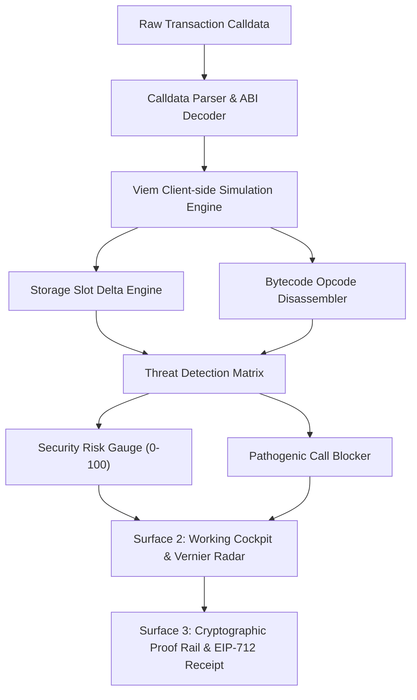

# Technical Architecture: Vernier

## 1. System Overview
Vernier operates as a client-side EVM pre-execution simulation sandbox and transaction intent firewall. It bridges raw calldata and user intent by compiling an execution trace, evaluating state deltas, and scoring threats before signing.



---

## 2. Directory Structure
```
vernier/
├── ORCHESTRATOR.md
├── PRD.md
├── Architecture.md
├── design.md
├── Tasks.md
├── Memory.md
├── Handoff.md
├── AGENTS.md
├── package.json
├── next.config.mjs
├── tsconfig.json
├── postcss.config.mjs
├── src/
│   ├── app/
│   │   ├── layout.tsx
│   │   ├── page.tsx
│   │   └── globals.css
│   ├── components/
│   │   ├── frontdoor/
│   │   │   ├── Header.tsx
│   │   │   ├── Hero.tsx
│   │   │   └── EconomicGrid.tsx
│   │   ├── console/
│   │   │   ├── IntentCharter.tsx
│   │   │   ├── VernierRadar.tsx
│   │   │   ├── RiskGauge.tsx
│   │   │   └── BytecodeTrace.tsx
│   │   └── proof/
│   │       ├── ReceiptRail.tsx
│   │       └── AttestationModal.tsx
│   ├── lib/
│   │   ├── simulation-engine.ts
│   │   ├── threat-detector.ts
│   │   └── formatters.ts
│   └── data/
│       └── attack-vectors.ts
```

---

## 3. Threat Detection Heuristics
1. **Unbounded Approvals (`MAX_UINT256`):** Detects `approve(spender, 0xffffff...)` or Permit2 signature requests giving blanket access.
2. **Untrusted `DELEGATECALL`:** Flags execution flows calling external unverified contracts with caller context.
3. **Storage Slot Hijack:** Monitors crucial slot offsets (`0x0`, `0x1`, `0x360894a13ba1a3210667c828492db98dca3e2076cc3735a920a3ca505d382bbc` ERC-1967 implementation slot).
4. **Gas Anomaly:** Spikes in gas units (>150,000 gas on straightforward transfers) signaling hidden malicious bytecode execution loops.
